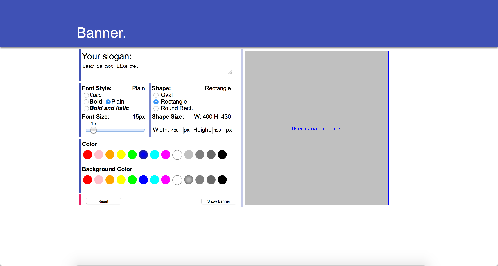

# Interactive_System_Design
Interactive System Design course repository.

## Form-based interfaces

A simple `.jsp` page paints banners using Java Applet.

Major features:
- There's a label next to each group responses to user's action, synchronously showing the user's choices;
- There are limitations and error check function on 
    + user's input on sizes: to make sure they are numeric values and no lager than certain values(400 and 430 px);
    + color choices: same color on front and background are not allowed;
- The reset button reset all input to default values.

